# The 100$ boat challenge  
## "There's many a slip 'twixt the cup and the lip ."

## The rules
* Each team must include 3 members
* There are no design restrictions or requirements. You may build a craft that you feel is
appropriate or entertaining.
* Only design work is permitted prior to race day. No prefabrication or lofting allowed.
* Each team has a budget of $100.00 (excluding tax) of regular priced material donated by
the company.
* Material lists must be submitted two weeks before the day of the challenge. If a list is not provided a suitable supply list will be filled at the organizers’ discretion.
* All materials will be delivered by the company, as ordered, to the contest area on the morning of the race.
* NO power tools or air tools are permitted. Hand tools, saw horses or worktables are
allowed.
* Boats must be paddled or rowed over the assigned course. These must also be made on
race day.
* All three members of the team must be in the vessel throughout the race.
* All crew MUST wear an approved personal floatation device.
* All boats must have a bailer.  

## Overview
What follows are the step by step instructions for a canoe style boat built with 100$ worth of materials. At the end of construction the boat _should_ be 15' long (14' at the bottom), 2' 1/2 wide and almost 2' tall. This structure _should_ be able to carry about 500 lbs.

## List of materials

### Materials
* Plywood 1/4" (bottom and paddle blades)
* 2x2 8' (keel)
* 2x4 4' (outside bow and stern)
* 1x2 4' (inside bow and stern)
* 8 of 2x2 8' (mainly for sideboards)
* 2x2 12' (ribs)
* 2x2 8' (ribs)
* 1x2 8' (gunwhale)
* 2x2 10' (paddles handle)
* Read Sheathing Tape 72 YDS
* Medium Clear Poly 500SFT 102"x59'

### Screws
* 36 x 1 1/4"
* 50 x 2 1/2"
* 8 x 1 3/4"
* 14 x 1"  

## Step 1 - Bow and Stern
We need to combine 2' of 1x2 with 2' of 2x4. We will need 10 1" 1/4 screws.
* Cut the 4' long of 1x2 in half. 
* Cut the 4' long of 2x4 in half. 
* Place one piece of 1x2 on top of one piece of 2x4 making sure that the 1x2 is aligned in the middle of the 2x4. (fig 1)  
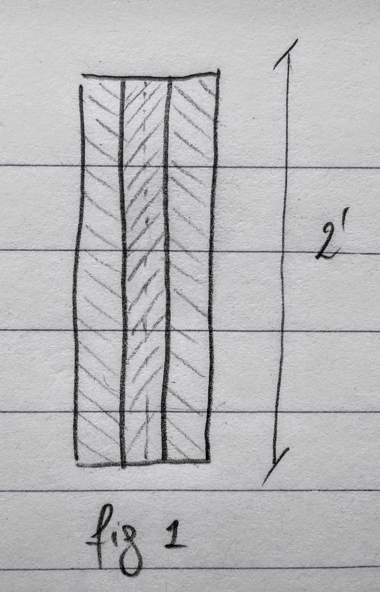  
* Now let's screw them together. Make sure to screw the 2x4 first. From the top, place one screw approximately every 3" 1/2 using five 1" 1/4 screws. (fig 2)  
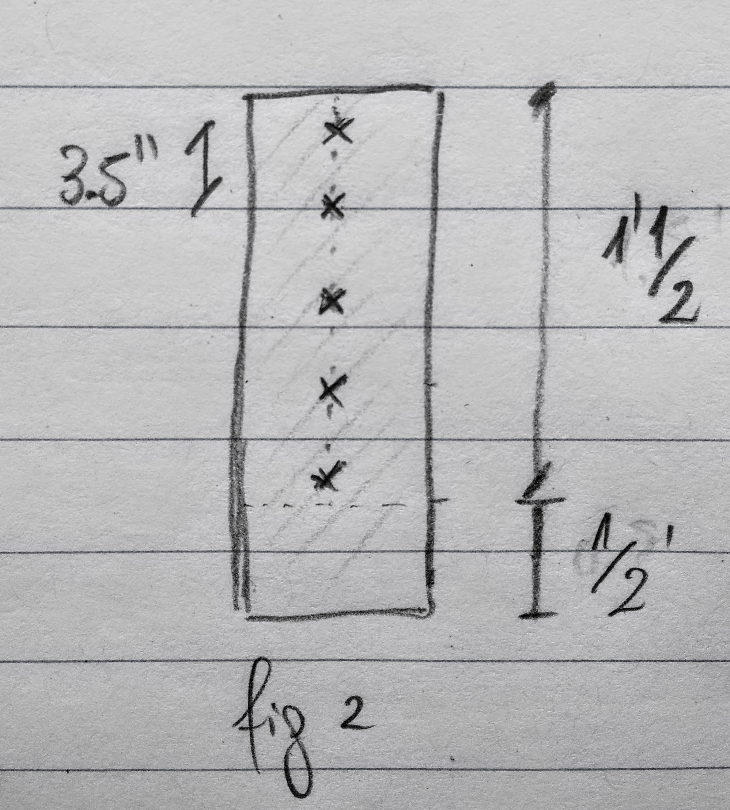  
Repeat this step for both bow and stern.
* You will notice that the screws don't reach the bottom. This is because bow and stern will have to be slightly tilted. As a consequence we'll have to trim the bottom. While looking at the two pieces of wood from the side, starting from the outside edge of the 2x4, trace a line at a 15 degree angle and cut. (fig 3)  
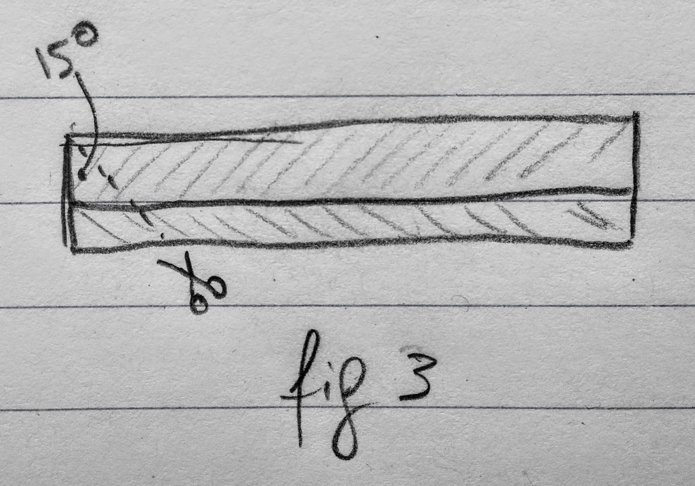  
Repeat this step for both bow and stern.  

## Step 2 - Building the rails
Since the bow and stern are tilted, the top and the bottom rails will have a different length. The math says the the rails will be 15' 1/4 on top and 14' 1/8 at the bottom. The rails are made of 2x2 and unfortunately the longest piece of 2x2 that we can get from the store is 12'. If we did the math right this means that in order to build the sideboards we will need to "stitch" two pieces of 2x2 so that it reaches the desired length.
* Get the four 12' 2x2 pieces and cut each of them in one piece that is 4' and one that is 8'.
* Set the four pieces of 4' 2x2 aside, we'll need them later when we build the ribs.
* Let's stitch the two 8' 2x2 pieces by using some plywood. Cut the plywood to yield 4 "slices" approximately 1" 1/2 tall and 4" wide.
* Grab two of the four 8' 2x2 pieces and place them one in front of the other so that they touch. Lay the 2 pieces of plywood at each side and screw them together using four 2" 1/2 screws as shown in fig 4.  
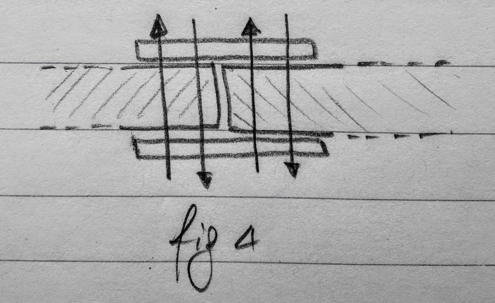  
The arrows indicate the directions of the screws. Repeat this step for the other sides (another 3 times: the remaining top side and the two bottom sides).
* Now we have four 16' 2x2. Cut two of them (for the top part) so that they are approximately 15' 1/4 and the other two (for the bottom part) so that they are approximately 14' 1/8 long. Don't be too precise, account for error and cut them an inch longer. 

## Step 3 - Attaching the rails to bow and stern  
* Grab the bow and stern from step 1.
* Since bow and stern are tilted you will need to slightly cut the ends of the rails to account for that angle. You can do that in advance by cutting the sideboards at a 105 degree angle. (fig 5)  
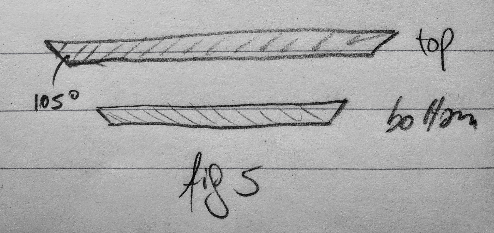  
* Align the uncut side of bow and stern with the top rails, and the cut side with the bottom ones. (fig 6)  
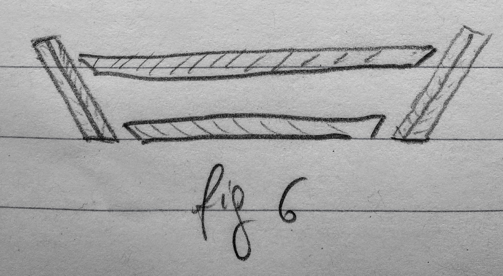  
* Screw the bow and stern to the rails by going into the bow and stern first. Use four 2" 1/2 screws for bow, same for stern. (fig 7)  
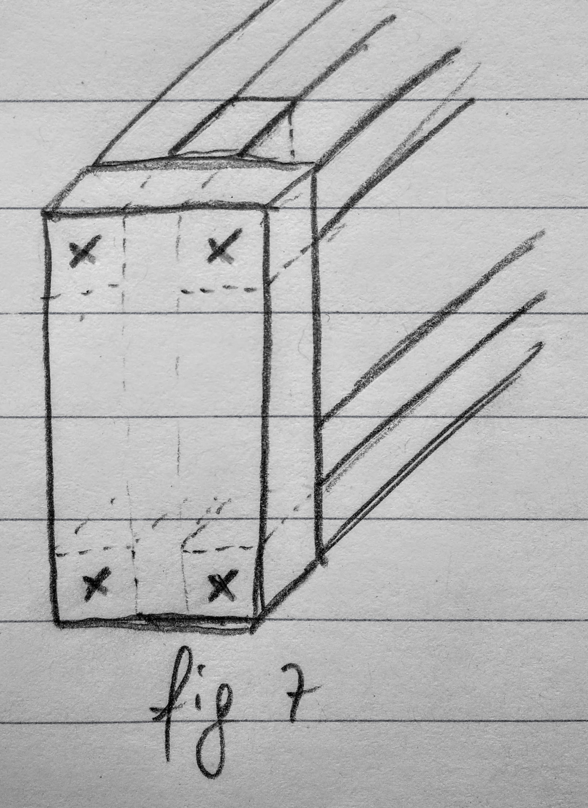  
* Set the whole thing aside.

## Step 4 - Building the ribs
* Let's get the four 4' 2x2 pieces we cut during step 2.
* Let's get the 12' 2x2 and let's cut it in three 4' long pieces.
* Let's get the 8' 2x2 and let's cut it in two 4' pieces.
* Now we have nine 4' 2x2 pieces. That's good since each rib uses three pieces. Yay, math to the rescue once again.
* Let's first cut the side of the ribs so that they are tilted as well. To do that let's grab six 4' 2x2 pieces and let's cut them at a 75 degree angle as show in figure 8. Those will make the side of the ribs.  
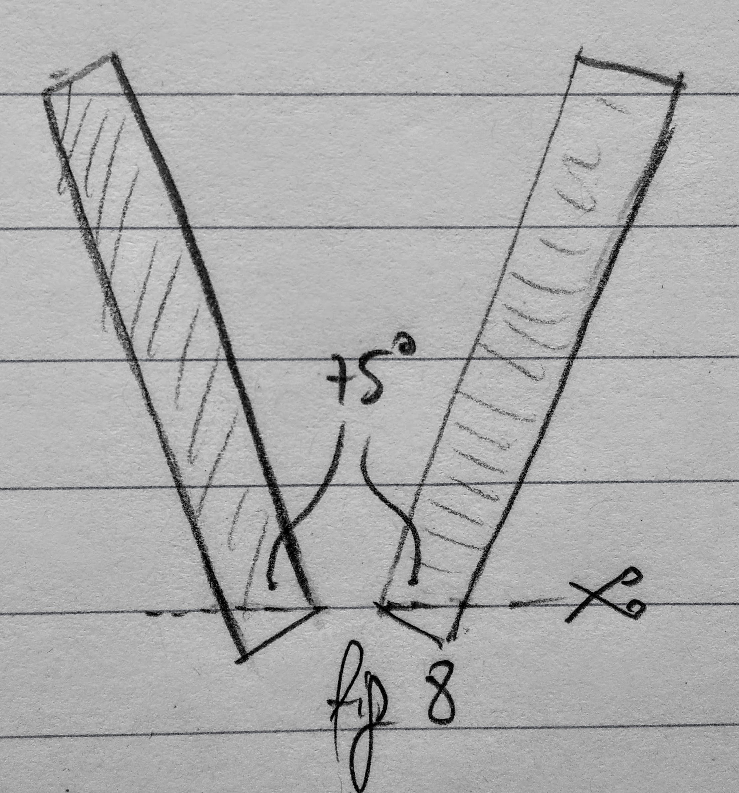  
* First we build the middle rib. Let's use two of the sides we just cut and one whole 2' long of the remaining three.
* Lay the cut sides on top of the whole piece and screw them together using two 2" 1/4 screws as show in fig 9.  
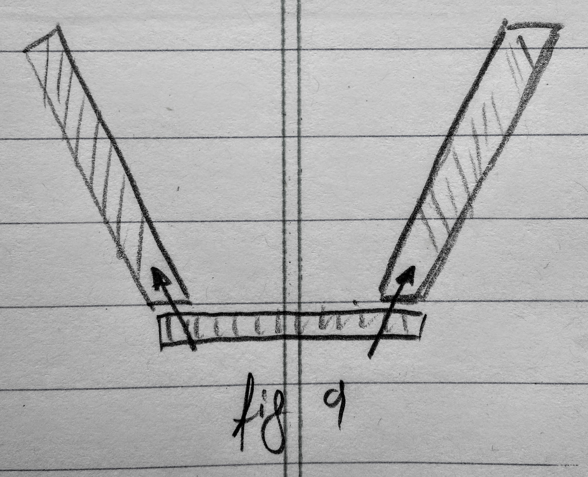  
The arrows show the direction of the screws.
* For the outside ribs we'll have to repeat the same step described above with the only difference that the bottom of the rib will need to be cut to account for the narrowing of the boat. The math is trickier here since the side curves. If we approximate we can say that the bottom of the rib should be around 1' 1/8. But before we cut it, wait, there might be a better way. If we place the middle rib in the middle of the structure we created at the end of step 3 we can likely get a more accurate estimate as shown in figure 10.  
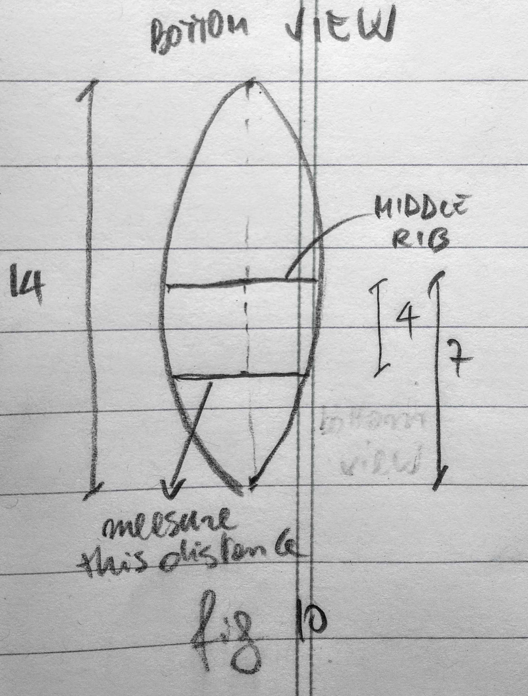  
* At the end of this step we should have one large rib and two narrow ones.

## Step 5 - Attaching the ribs to the skeleton
* To attach the ribs to the frame we have to first slide them in between the rails. Do that slowly by placing the larger ribs exactly in the middle first. That should be at 7' 1/2. After we slide the middle rib we will secure it by using 4 of 2" 1/2 screws. We will screw from the outside to the inside towards the middle of the 2x2 as shown in figure 11.  
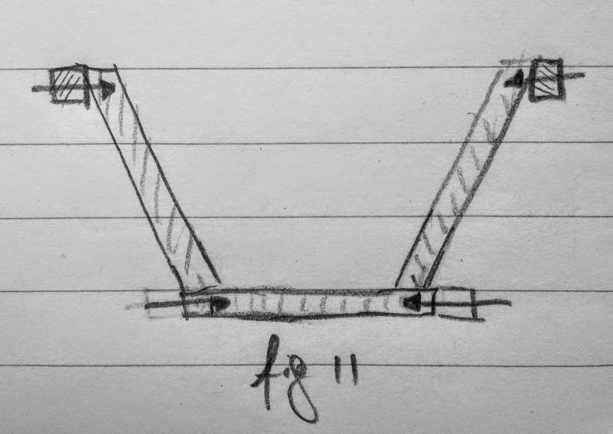  
* Do the same with the other ribs making sure to space them about 4' from the middle rib.
* To make the structure more secure we will place the another piece of wood on top of the ribs. Let's cut the 8' 1x2 so that it yields one piece about 2' 1/2 wide for the middle rib. Cut the remaining 5' 1/2 in two pieces of the right size (to be measured on the spot) for the side ribs.
* Secure the wood to the ribs by using two 1" 3/4 screws for each rib as shown in figure 12.  
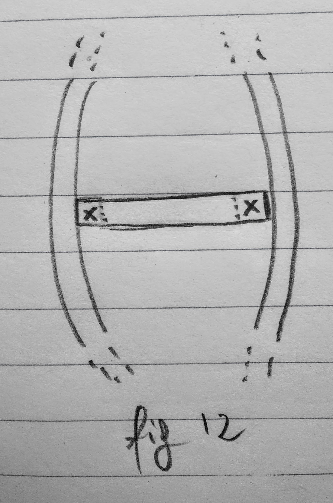  
At this point the skeleton _should_ be fairly sturdy.

## Step 6 - Attaching the bottom to the skeleton
Now we have to attach the plywood to the bottom of the boat so that it will be sturdy enough to carry about three people. The plywood will cover only the space in between the side ribs.
* Lay the plywood on a flat surface and place the skeleton on top of it making sure that the bottom side is down. (fig 13)  
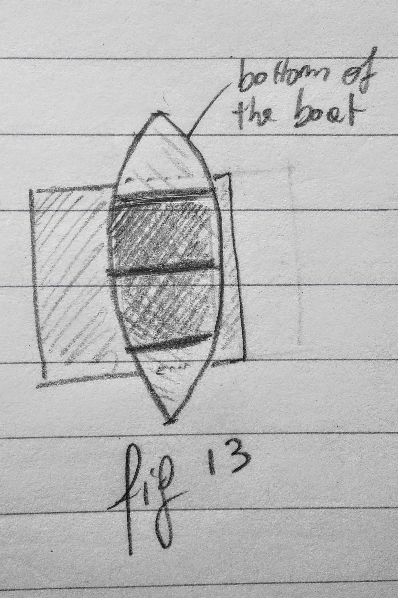  
* With a marker outline the outside of the boat on the plywood. The plywood will cover the darker part as shown in the figure above. Note: Make sure to cut the shape on the side of the plywood so to save the other plywood for the paddles later.
* Cut the plywood alongside the outline.
* Flip the skeleton upside down and place the plywood on top in between the ribs and screw it to the bottom using four 1" 1/4 screws as shown in figure 14.  
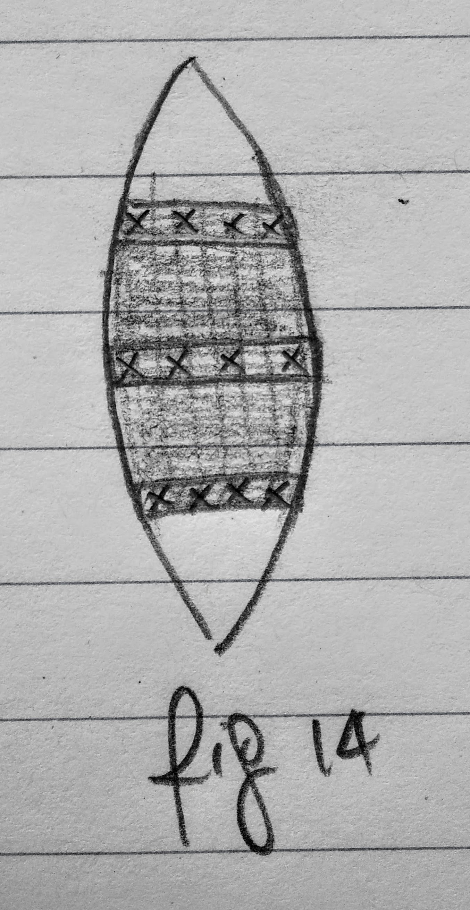  
* Now we have to attach the keel to make sure that if we float, we don't capsize. The keel will cover the distance between the two outside ribs. Let's get the 8'  2x2 piece and secure it with three 2" 1/2 screws as shown in figure 15.  
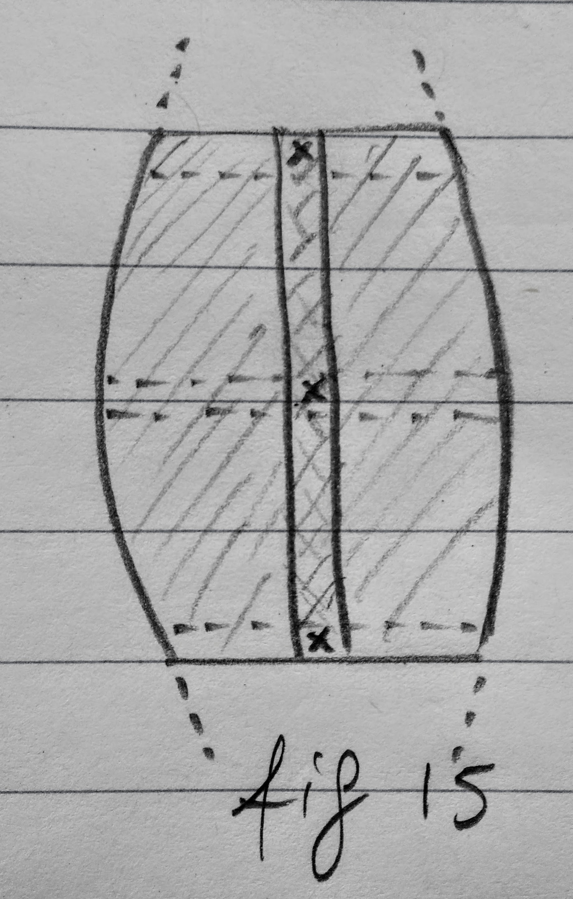  

## Step 7 - Wrap the sides in plastic
If you manage to get to this point then congratulations. Now we have to wrap the remaining "holes" to make sure that this thing actually floats.
* Wrap the sides and the remaining parts of the bottom with the medium clear poly and secure it with duct tape. I don't have clear instructions for this step, we have to try to seal it as best as possible.

## Step 8 - Building the paddles
The finish line is close. You are almost done.
* Let's grab the 10' long 2x2 and cut three 3' pieces.
* From the leftover plywood let's cut the blades for the paddles. The size should be around 9" x 12" or larger.
* Attach the blades to the handles using two 1" 1/4 screws per paddle as shown in figure 16.  
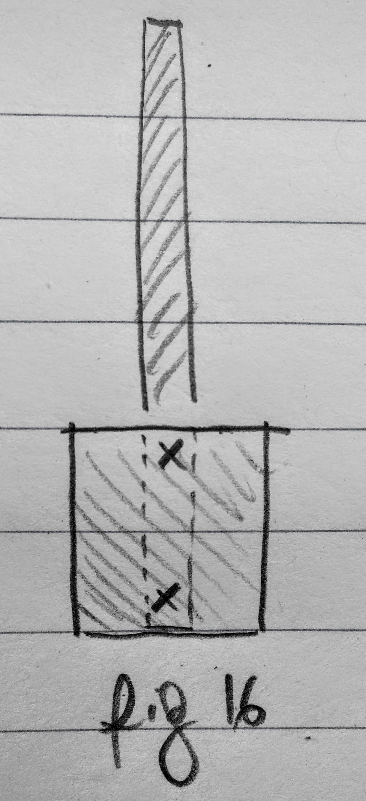  
If you have spare screws place one in the middle too.

## Step 9 - Test it out
* Cross fingers.
* Place boat in water.
* Go on board.

---  
# FAQ
* Why?
    * Annual build a boat competition. Previous years videos: [2007](https://www.youtube.com/watch?v=salfJZRClY8), [2010](https://www.youtube.com/watch?v=XSuyy3B8EsQ), [2011]([2013](https://www.youtube.com/watch?v=OW1iRPvzVrI)), [2012](https://www.youtube.com/watch?v=Ey8Tpd3E-Ck), [2013](https://www.youtube.com/watch?v=OW1iRPvzVrI), [2015](https://www.youtube.com/watch?v=EkBSwAtQvaw&t=1s).
* Dollars?
    * Canadian dollars. The prices are specific to the local store that sponsors the 100$ boat challenge.
* What's with the quote?
    * I was looking for the italian translation of "tra il dire ed il fare c'è di mezzo il mare" and it turns out this is the closes idiom.
* Do you know how to build boats?
    * No. It will be clear once you start reading.
* Why should we listen to you?
    * Ha. You shouldn't.
* Have you build this boat already?
    * Nope, but we are going to soon. Will adjust this project based on mistakes, feedback and things learnt along the way.  

---
# Credits
* Since I have never built a boat in my life the only thing I could do was searching the web for people who have attempted this feat in the past or that generally speaking have built boats from scratch. In particular:
    * [The Classic Cajun Pirogue](http://www.unclejohns.com/boat/default.htm) from Uncle John.  
    * [Ulrich Burkhalter](https://www.flickr.com/photos/uloo/3846423069/in/album-72157622115606712/)'s 100$ canoe project.  

* Since my memory failed me when trying to remember specific high school theorem I resorted to a couple of online tools to calculate the length of all the pieces and the angle at which they should be cut. In particular:  
    * [Parabolic arch calculator](http://keisan.casio.com/exec/system/1223291032)
    * [Triangle theorems calculator](https://www.calculatorsoup.com/calculators/geometry-plane/triangle-theorems.php)  

* Needless to say the support and knowledge of friends and family.